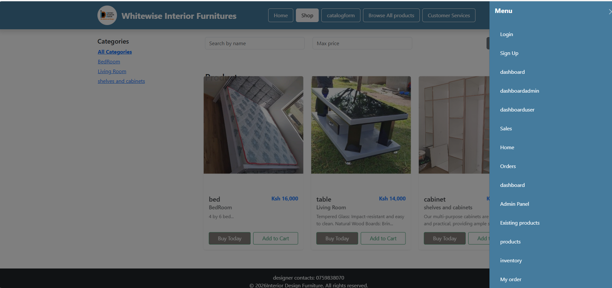
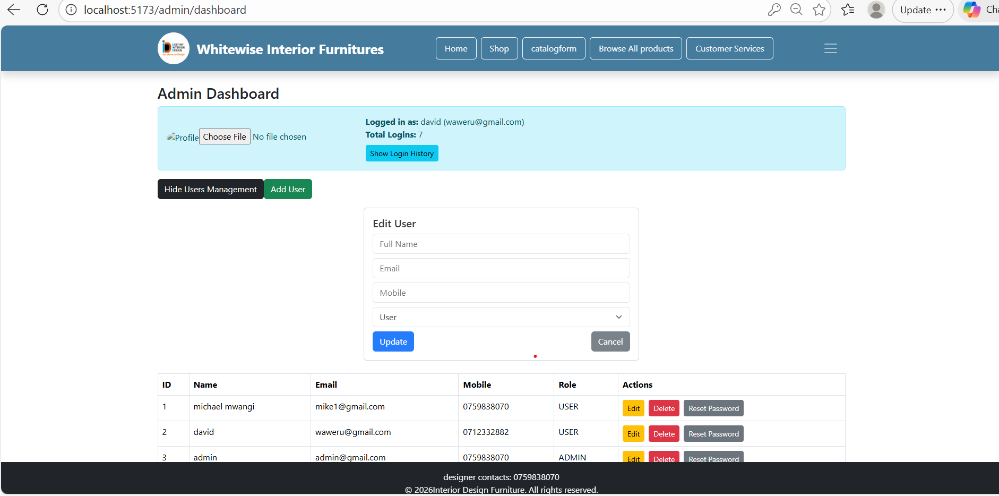
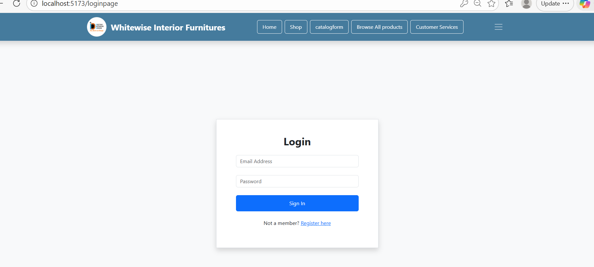
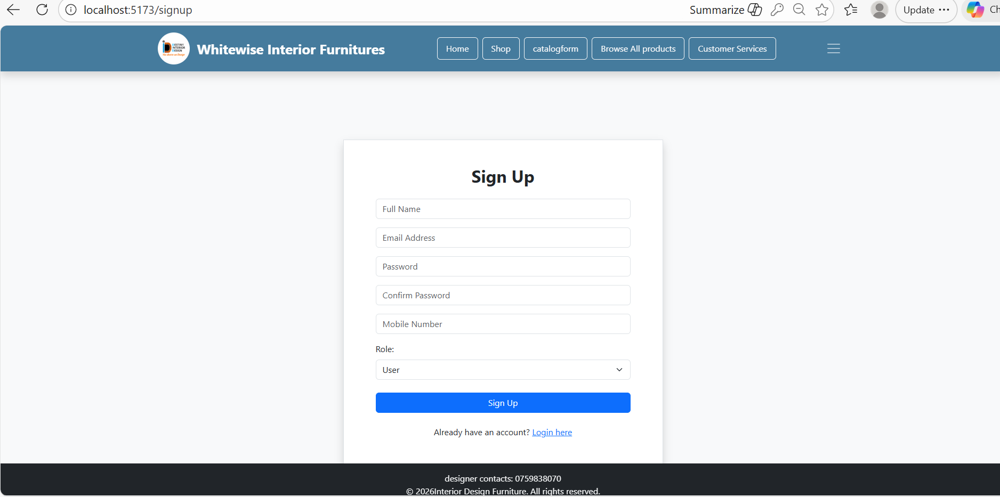
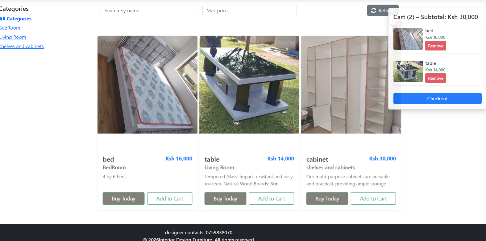

# 🪑 Interior Design Furniture Management System


### Homepage
<p align="center">
  
</p>

### Admin Dashboard
<p align="center">
  
</p>

### Login Page
<p align="center">
  
</p>

### Signup Page
<p align="center">
  
</p>

### Shopping Cart
<p align="center">
  
</p>


Full-stack e-commerce platform for browsing, selling, and managing furniture products.  
This project demonstrates user & admin authentication, product management, order handling, and a responsive UI — perfect for a professional portfolio.

---

## 🔥 Features
- User & Admin authentication (login/register)
- Furniture catalog (products with images, categories, prices)
- Shopping cart & order placement
- Admin dashboard (add/edit/delete products)
- Secure JWT-based authentication
- Login history tracking
- Sales records & dashboard reports
- Orders record & inventory management

---

## 💻 Tech Stack
- **Frontend**: React (Vite) → `/client`
- **Backend**: Spring Boot 3 + Spring Security + JWT + MySQL → `/interior_design`
- **Database**: MySQL

---

## 🛠️ Setup Instructions

### Prerequisites
- Java 17+ (for backend)
- Node.js 18+ & npm (for frontend)
- MySQL server running

### Backend
```bash
cd interior_design
mvn clean install
mvn spring-boot:run
# Runs on: http://localhost:9193
